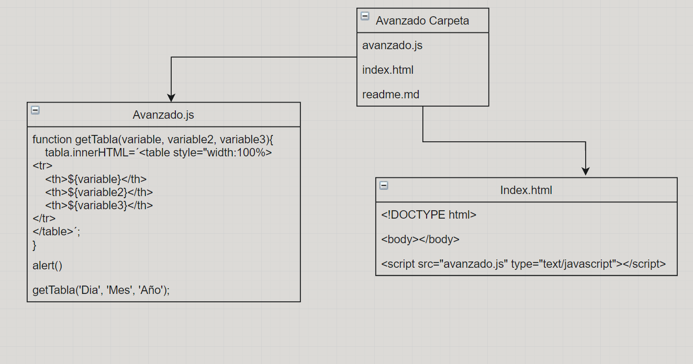

# DAW-EC_JJA
# Analisis 🔎 Avanzado JS1 📀📒 

## Script en JavaScript 🎓
___
JavaScript es un lenguaje de programación que permite el script de eventos, clases y acciones para el desarrollo de aplicaciones Internet entre el cliente y el usuario. 

JavaScript permite con nuevos elementos dinámicos ir más allá de clicar y esperar en una página Web. Los usuarios no leerán únicamente las páginas sino que además las páginas ahora adquieren un carácter interactivo. Esta interacción permite cambiar las páginas dentro de una aplicación: poner botones, cuadros de texto, código para hacer una calculadora, un editor de texto, un juego, o cualquier otra cosa que pueda imaginarse.

___
## Tabla HTML 📑
___
Las etiquetas "form" son la base para el traspaso de datos a los programas CGI
en el servidor.
Un formulario de una página web es una colección de campos de entrada que comunican su contenido al servidor.
___
## UML Diseño Intermedio JS1 🖼
___
 
