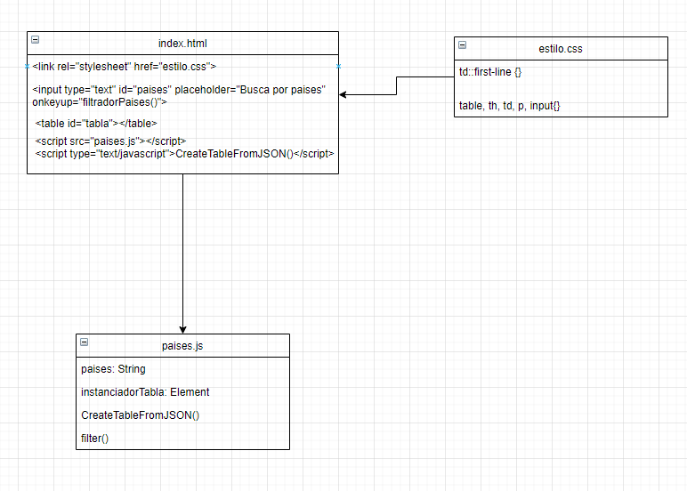

# DAW-EC_JJA
 
# Analisis HTML & JavaScript 📑

## DOM 📋
___
El `DOM` es la estructura de objetos que genera el navegador cuando se carga un documento y se puede alterar mediante `Javascript` para cambiar dinámicamente los contenidos y aspecto de la página.
___
## Script 
El elemento `HTML` Script `` se utiliza para insertar o hacer referencia a un `script` ejecutable dentro de un documento `HTML` o `XHTML`.

Los `scripts` sin atributo `async` o `defer`, así como las secuencias de comandos en línea, son interpretados y ejecutados inmediatamente, antes de que el navegador continúe procesando la página.

___
## OnKeyUp
Es un evento de HTML se produce cuando el usuario deja de escribir y la informacion iria hacia una variable en este ejercicio en un Js.
___

## InnerHTML
`InnerHTML` es una propiedad que nos permite leer un dato o asignarlo al contenido de un `div` o bien, del mismo control. Nos facilita la asignación de valores a controles. En el ejemplo utilizamos la propiedad  `instanciadorTabla.innerHTML` para tomar la referencia del `<id="search">` del contenedor.
___
## GetElementById
Este metodo coge un elemento del documento por medio del valor del atributo id que se le haya asignado.
___
## Value
Value es el valor que tiene los objetos element que puedan tener un contenido, como puede ser: las entradas `<input>` de un formulario.
___
## Includes()  
Es un metodo que evalua si un string contiene un valor String devuelve true si lo contiene y lo contrario falso si no lo contiene.
___

## UML Diseño Intermedio JS2 🖼
___

