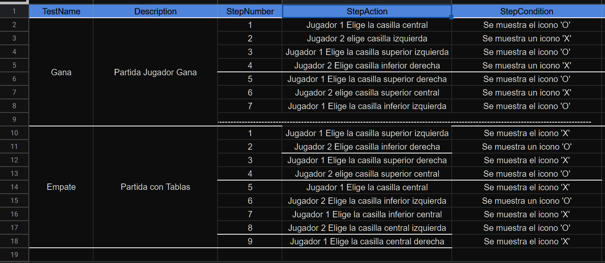

# DAW-EC_JJA
 
# Analisis Tres en Raya

## Reglas 🕹
___
Las Reglas son cada uno tiene un turno, y una vez que lo pones en una casilla el turno tuyo se te acaba, y comienza el turno del otro jugador, por otra parte esa casilla que esta rellenada ya sea por una `X` o una `O` no se podra rellenar de nuevo.
___
## Como Jugar 🎮
Cada jugador elige las `X` o las `O`, y en su turno debe poner una, intentando conseguir 3 seguidas en una línea vertical, horizontal o diagonal. Una vez se llenan todos los espacios se termina la partida, finalizando en tablas si ninguno consigue enlazar tres de sus fichas seguidas.
___

## UML Diseño Intermedio JS3 🖼
___

## UML Diagrama de Flujos Intermedio JS3 🖼
___

## UML Caso de Pruebas Intermedio JS3 🖼
___

