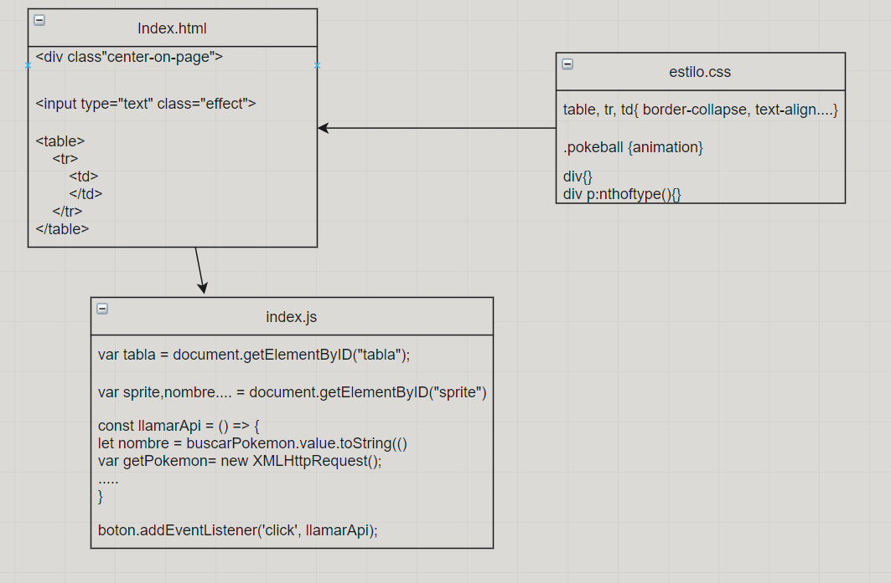

# DAW-EC_JJA
 
# Analisis Intermedio 📊
___

___
## API 📚
___
Interfaz de programación de aplicaciones
### 쯈ue es una API?
___
Una API es un conjunto de definiciones y protocolos que se utiliza para desarrollar e integrar el software de las aplicaciones.

___
## Pokemon 🐾
___
Los Pokémon son una clase de criaturas inspiradas en animales reales, insectos, objetos, plantas o criaturas mitológicas.

Estos pokemons tienen diferentes habilidades tanto como sus tipos de la familia de agua, fuego, dragon, planta, veneno, volador, lucha, etc....
___
## XMLHttp 📃
___
XMLHttpRequest (XHR), también referida como XMLHTTP (Extensible Markup Language / Hypertext Transfer Protocol), es una interfaz empleada para realizar peticiones HTTP y HTTPS a servidores Web. Para los datos transferidos se usa cualquier codificación basada en texto, incluyendo: texto plano, XML, JSON, HTML y codificaciones particulares específicas. La interfaz se implementa como una clase de la que una aplicación cliente puede generar tantas instancias como necesite para manejar el diálogo con el servidor.

El uso más popular, si bien no el único, de esta interfaz es proporcionar contenido dinámico y actualizaciones asíncronas en páginas web mediante tecnologías construidas sobre ella como por ejemplo AJAX.
___

## UML Diseño Intermedio JS4 🖼
___

___