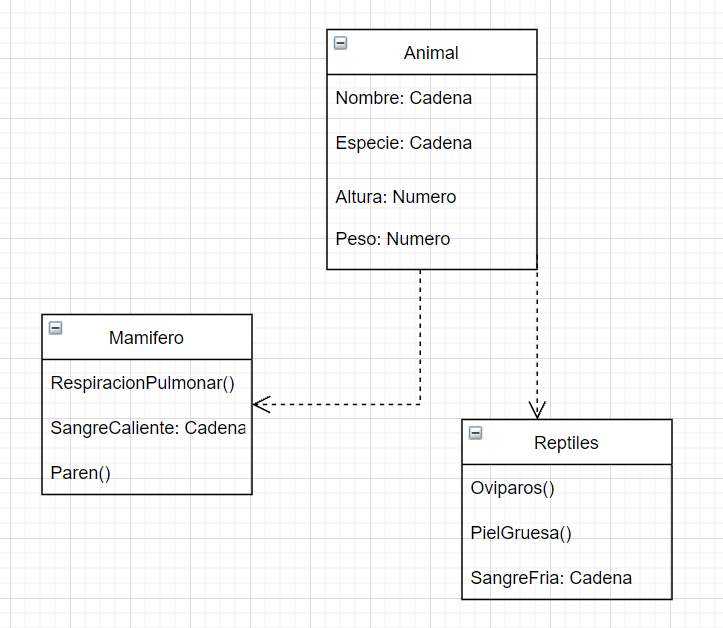

# DAW-EC_JJA

## Analisis Pseudocodigo 🔍 Analisis Java 🔍 Analisis Python 🔍
___

### Clases 📋
Las clases representan entidades o conceptos,
estas clases es una forma de definir el conjunto
de variables, métodos apropiados para operar con datos.
### Objetos 📖
Los objetos son datos en los que se ordena el conjunto de informacion
esto hace que pueda ser mas personalizado y mas legible a la hora
de hacer el codigo en POO.
### Instancias 🏨
Las instancias especifica una ocurrencia en una determinada clase o entidad,
esto hace que en lugar de tener atributos tiene variables.
___

# UML Diseño 🖼

