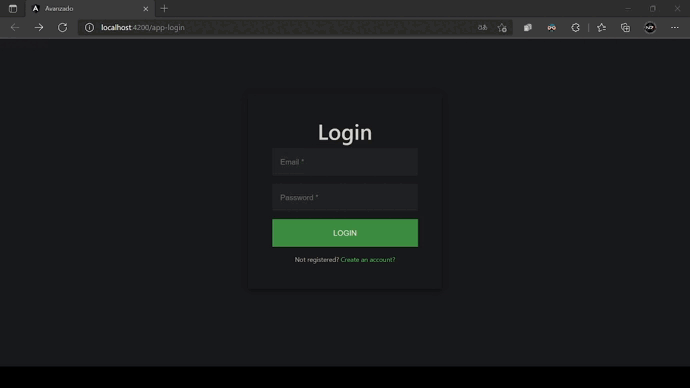
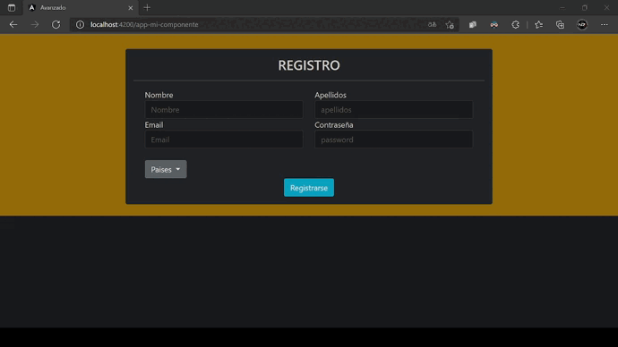

# Intermedio AN 1 💿

# Angular-CLI 📐

`Angular` es un `framework` para aplicaciones web desarrollado en `TypeScript`, de código abierto, mantenido por `Google`, que se utiliza para crear y mantener aplicaciones web de una sola página.

Para saber mas sobre [Angular](https://angular.io//).

___

# ¿Que es un Componente? ⚙

Un componente en `Angular` es un elemento que está compuesto por:
~~~
Un archivo que será nuestro `Template` (app. ... ts), ese archivo debe incluir una clase y esta es la que va a contener las propiedades que se van a usar en la vista (HTML) y los métodos que será las acciones que se ejecutarán en la vista.
~~~
### Se cree crea con el siguiente comando:
> ng g c [nombreComponente]
# Gifs de Prueba 🎞

## 1º Primer Gif 🥇

___
## 2º Primer Gif 🥈

___

