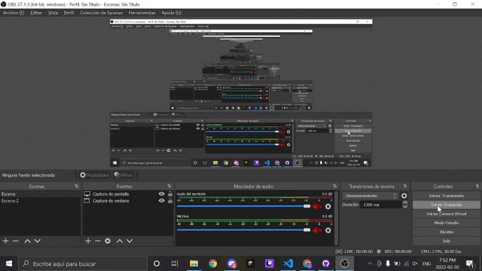
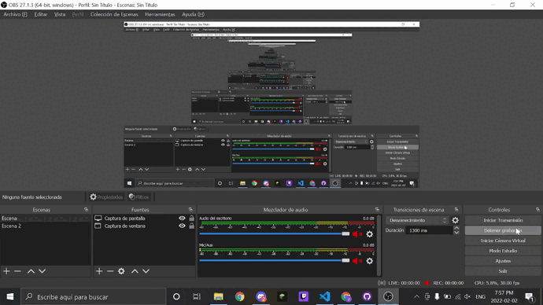

# AN2 Intermedio 💿

Este proyecto esta creado por [Angular CLI](https://github.com/angular/angular-cli) version 13.2.0
___
## Uso de Navegación o Routing Module 🚤
___

### ¿Qué es routing en Angular? 📡
___

    --- Introducción al Routing ----

El sistema de `routing` es el encargado de reconocer cuál es la `ruta` que el `usuario` quiere mostrar, presentando la pantalla correcta en cada momento. Esto es útil por varios motivos, entre ellos:
___
1. Permite que la `aplicación` responda a `rutas internas`. Es decir, no hace falta entrar siempre en la pantalla principal de la `aplicación` y `navegar` hasta la pantalla que queremos ver realmente.
___
2. Permite que el `usuario` pueda usar el historial de `navegación`, yendo hacia atrás y hacia adelante con el `navegador` para volver a una de las pantallas de `aplicación` que estaba viendo antes.

___

    --- ¿Como usarlo? ---

`Angular` nos permite construir `Single Page Applications` (SPAs, por sus siglas en inglés). ... Con el `Router` podremos crear varias páginas con distintas `URLs`, `tipo` / `user`, /`register`, etc, sin necesidad de crear otro documento `HTML` a parte del que ya viene con `Angular`, el `index`.

## ¿Que es NG? 🗄
___
El comando ng new crea un área de trabajo de `Angular` en la carpeta y genera una nueva estructura de la aplicación. ... Puedes editar los archivos generados directamente, o agregarlos y modificarlos usando los comandos del `CLI`.
___
## ¿Que es un componente? 📎
___

Un `componente` en `Angular` es un bloque de código `re-utilizable`, que consta básicamente de 3 archivos: 
~~~
Un CSS, un HTML (también conocido como plantilla o en inglés, template) y un TypeScript (en adelante, TS). 
~~~
La carpeta `app` con la que viene `Angular` por defecto es un `componente`, aunque un tanto especial.
___
## Para mas ayuda ❗

Puedes usar el comando `ng help` o ver mas sobre la documentacion de Angular [Angular CLI Visión general y referencia de comandos](https://angular.io/cli) Pagina Oficial.

# Gifs de Prueba 🎞

## 1º Primer Gif 🥇

___
## 2º Primer Gif 🥈

___
## 3º Primer Gif 🥉

___

# FIN 🔚