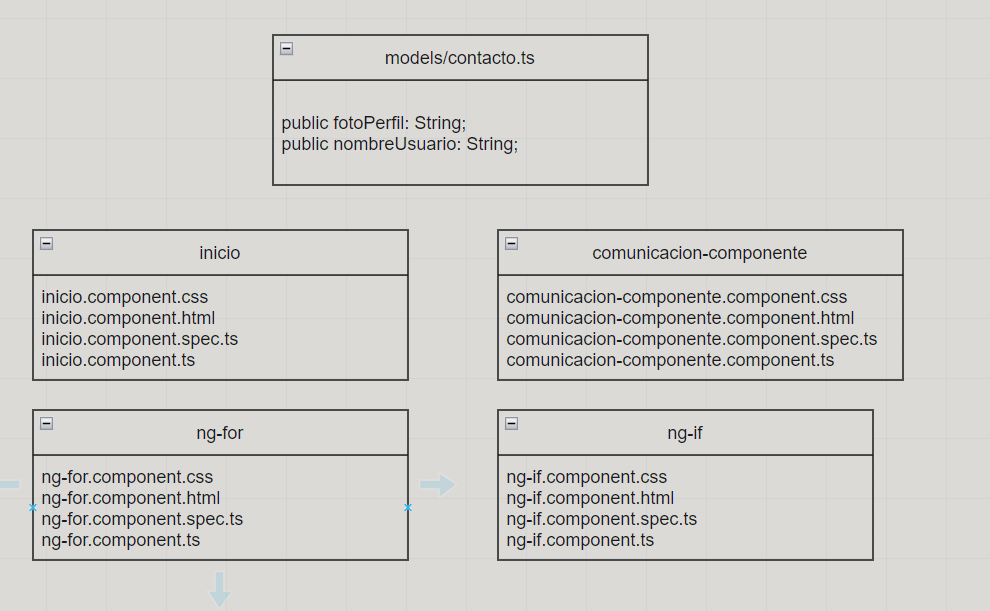
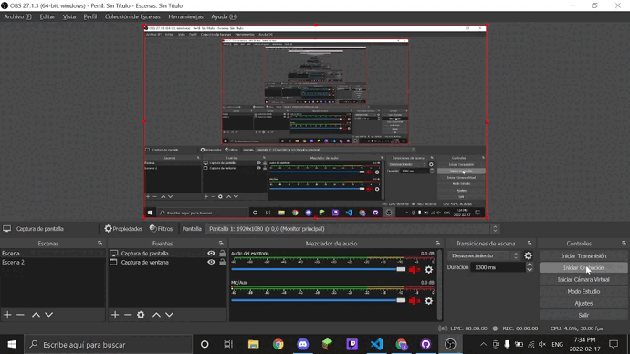
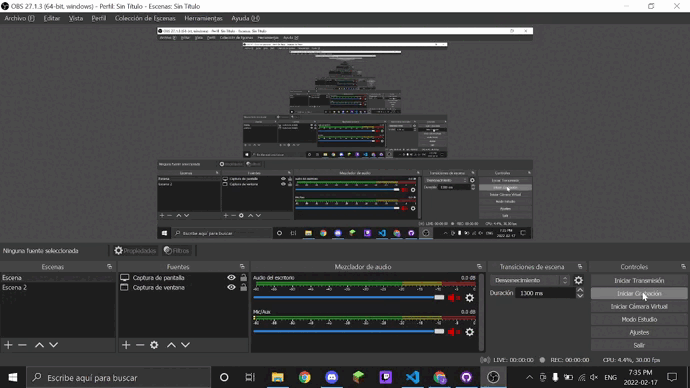
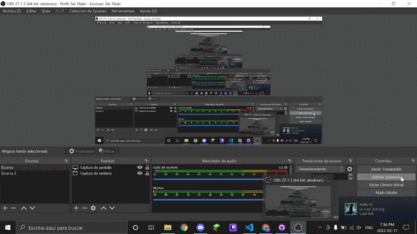

# Intermedio

Este proyecto ha sido creado por [Angular CLI](https://github.com/angular/angular-cli) version 13.1.3.

___
## Ng-If ❓
___

La directiva estructural `*ngIf` permite mostrar u ocultar elementos del `DOM`. Recordemos que una etiqueta solo puede tener una directiva estructural, luego si podemos disponer dentro de una etiqueta interior otro directiva estructural.
___
## Ng-For 🧮
___
Explicamos la directiva `ngFor`, o `*ngFor`, que nos permite repetir una serie de veces un bloque de `HTML` en aplicaciones `Angular`. En este artículo vamos a conocer y practicar con una directiva de las más importantes en `Angular`, que es la directiva `ngFor`, capaz de hacer una repetición de elementos dentro de la página.
___
## Comunicacion entre Componentes 📡
___
Las aplicaciones web en las que destaca `Angular` suelen ser complejas y con mucha variedad funcional en diversas páginas. A menudo esas páginas están repletas de `formularios`, `informes` y `botones`. 
~~~
La solución viene de mano del viejo principio divide y vencerás: La [componentización]
~~~~
___
## UML Diseño Intermedio AN3 🖼
___

___

# Gifs de Prueba 🎞

## 1º Primer Gif 🥇

___
## 2º Primer Gif 🥈

___
## 3º Primer Gif 🥉

___

# FIN 🔚
