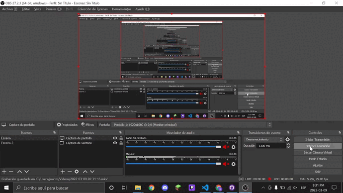
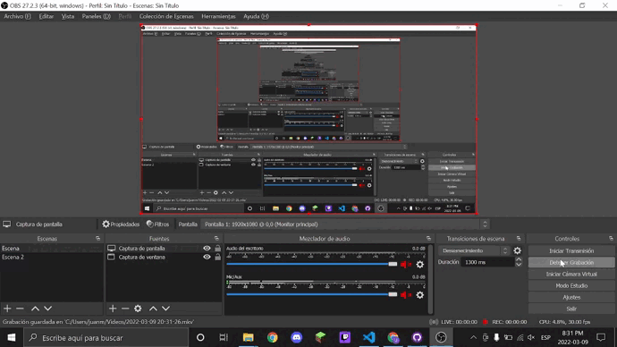
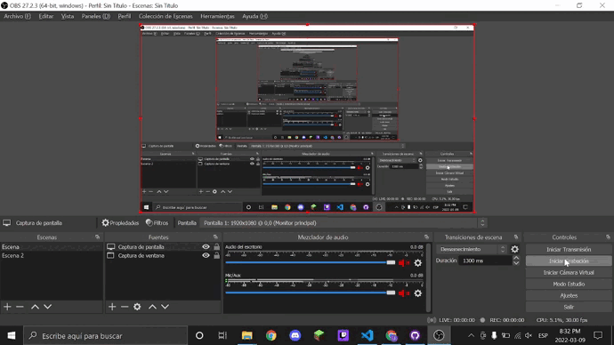

# Intermedio AN4 💿

This project was generated with [Angular CLI](https://github.com/angular/angular-cli) version 13.2.5.
___
## PokeAPI 🐾
___
Ese es el propósito de `Pokéapi`, una `API RESTful` creada específicamente para informar a todos los jugadores de `Pokémon`. Es, de lejos, la mayor base de datos gratuita sobre `Pokémon`, y puedes utilizarla tanto y como quieras.

## ¿Que es un servicio? 🚽
___

Un `servicio` es la capa encargada de traer/proporcionarnos los datos a nuestra aplicación de `Angular`. Normalmente, nuestro `servicio` para acceder a estos datos suelen conectarse al servidor donde están almacenada dicha información, por ejemplo una `BBDD`, una `API Rest`, etc.

___
## DropDown 📏
___
En una `Interfaz gráfica de usuario`, lista desplegable es un widget que permite al usuario seleccionar una o más opciones. Las hay de dos tipos: las que aparecen con el fin de seleccionar sólo una opción, y las que permiten seleccionar varias opciones y muestran al menos dos.
___

# Gifs de Prueba 🎞

## 1º Primer Gif 🥇
;
___
## 2º Primer Gif 🥈
;
___
## 3º Primer Gif 🥉
;
___

# FIN 🔚

### Comentario Final
~~~
Me ha encantado mucho las clases y las retrospectiva Ricardo ha sido la mejor clase que he tenido en todos mis años academicos, todo echo con tranquilidad, todo sin presiones y siempre con una explicación excelente increible. Muchas Gracias por todo Ricardo <3 ❤ 💯
~~~ 